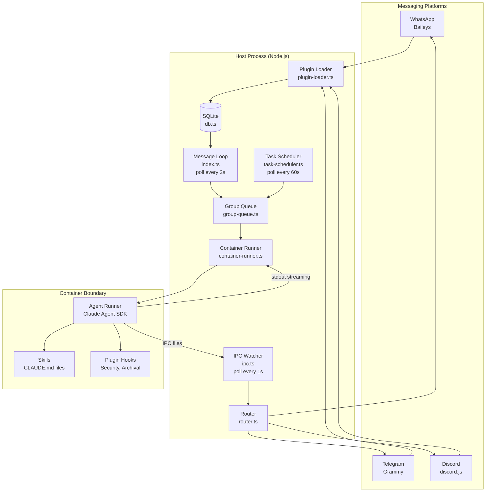
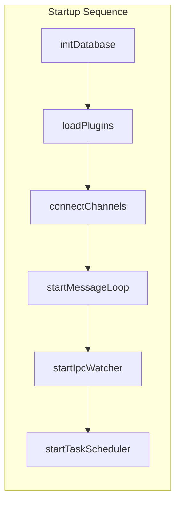
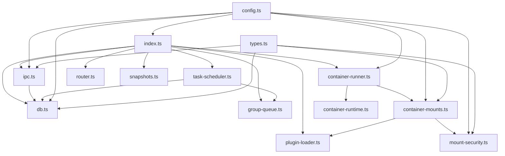
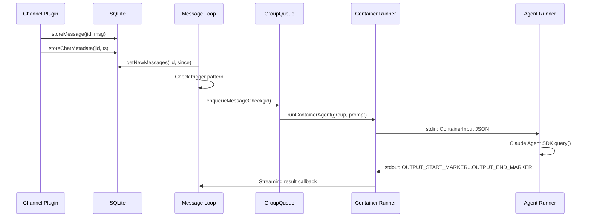
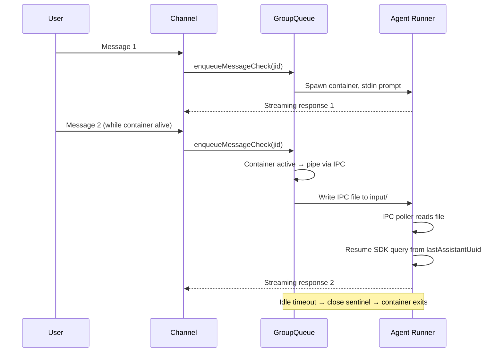
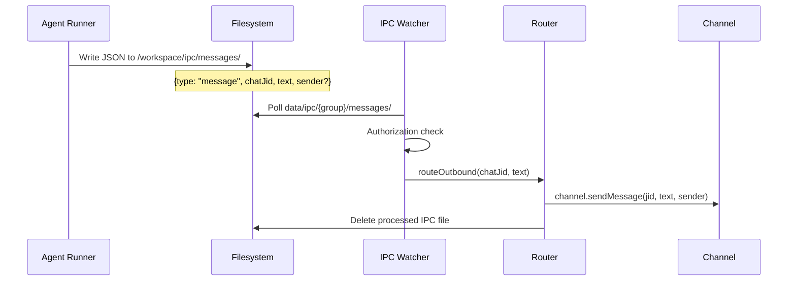

# System Architecture

## Overview

NanoClaw is a personal Claude AI assistant that routes messages from communication channels to isolated Claude Agent SDK instances running in Docker or Apple Container. Single Node.js host process, ~6,300 lines of TypeScript.

### Core Principles

1. **Small enough to understand** — One process, handful of source files
2. **Secure by isolation** — Agents run in containers with explicit mount boundaries
3. **Built for one user** — Working software you fork and customize
4. **AI-native** — Claude Code guides setup, debugging, and customization
5. **Skills over features** — Contributors add transformation skills, not configuration

## High-Level Architecture



## Component Relationships



### Module Dependency Graph



## Data Flow

### Inbound Message Flow



### Multi-Turn Conversation Flow



### Outbound Message Flow (IPC)



## Polling Architecture

Three independent polling loops run concurrently:

| Loop | Interval | Purpose | Source |
|------|----------|---------|--------|
| Message Loop | 2s | Fetch new messages from DB, trigger agent | `src/index.ts` |
| IPC Watcher | 1s | Process outbound messages and task commands | `src/ipc.ts` |
| Task Scheduler | 60s | Find due scheduled tasks, enqueue execution | `src/task-scheduler.ts` |

## Concurrency Model

```
                    ┌─────────────────────┐
                    │  MAX_CONCURRENT = 5  │
                    └─────────┬───────────┘
                              │
        ┌─────────────────────┼─────────────────────┐
        │                     │                     │
   ┌────┴─────┐         ┌────┴─────┐         ┌────┴─────┐
   │ Group A   │         │ Group B   │         │ Group C   │
   │ 1 container│        │ 1 container│        │ Waiting... │
   │ at a time  │        │ at a time  │        │ (queued)   │
   └───────────┘         └───────────┘         └───────────┘
```

- Global limit: `MAX_CONCURRENT_CONTAINERS` (default 5)
- Per-group: exactly 1 container at a time (serialized)
- Follow-up messages pipe to active container via IPC (no new spawn)
- Tasks prioritized over messages in drain order
- Exponential backoff on failure: 5s, 10s, 20s, 40s, 80s (5 retries max)

## Filesystem Layout

```
nanoclaw/
├── src/                    # TypeScript source (compiled to dist/)
├── container/
│   ├── Dockerfile          # Agent container image
│   ├── build.sh            # Build script (merges Dockerfile.partial)
│   ├── agent-runner/src/   # In-container agent runner
│   └── skills/             # Core skills mounted into containers
├── plugins/
│   ├── channels/           # Channel plugins (whatsapp, telegram, discord)
│   └── {name}/             # Skill plugins
├── groups/
│   ├── main/               # Main group folder (CLAUDE.md, logs, conversations)
│   ├── global/             # Global CLAUDE.md (shared read-only to all groups)
│   └── {name}/             # Per-group isolated folders
├── data/
│   ├── ipc/{group}/        # Per-group IPC directories
│   │   ├── input/          # Follow-up messages to container
│   │   ├── messages/       # Outbound messages from container
│   │   └── tasks/          # Task commands from container
│   └── channels/{name}/    # Per-channel auth data
├── store/
│   ├── messages.db         # SQLite database
│   └── backups/            # Automatic DB backups
├── logs/                   # Application logs
└── .env                    # Configuration and secrets
```
