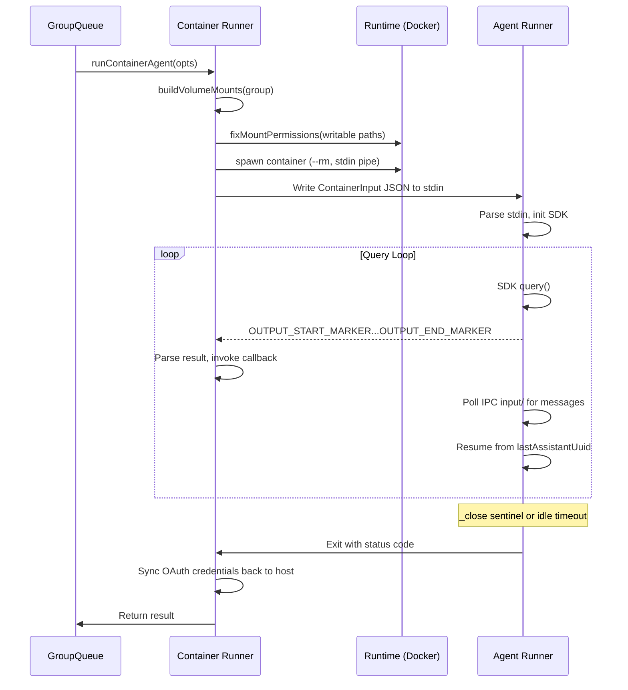

# Container System

## Overview

NanoClaw runs Claude agents in ephemeral Linux containers (Docker or Apple Container). Each container gets an isolated filesystem with explicit mount boundaries.

## Container Image

Built via `container/build.sh` from `container/Dockerfile`.

**Base:** `node:22-slim`

**Installed:**
- Claude Agent SDK (`@anthropic-ai/claude-agent-sdk`)
- Chromium + Playwright (for browser automation)
- Git, ripgrep (agent tools)
- Python3 (for skill scripts)

**Dockerfile.partial merging:** Build script scans `plugins/*/Dockerfile.partial` and `plugins/*/*/Dockerfile.partial`, inserting their contents before the final `USER node` line. This enables plugins to add system dependencies without modifying the core Dockerfile.

**Build command:**
```bash
./container/build.sh
```

## Container Lifecycle



## Volume Mounts

### Main Group

| Container Path | Host Path | Mode |
|----------------|-----------|------|
| `/workspace/project` | Project root | Read-write |
| `/workspace/group` | `groups/main/` | Read-write |
| `/workspace/global` | `groups/global/` | Read-write |
| `/workspace/ipc` | `data/ipc/main/` | Read-write |
| `/workspace/skills/{name}` | Core + plugin skills | Read-only |
| `/workspace/plugin-hooks` | Plugin hook files | Read-only |
| `/workspace/extra/{name}` | Additional mounts | Per-allowlist |
| `/app/src` | Agent runner source | Read-only |
| `/home/node/.claude` | Session directory | Read-write |

### Non-Main Groups

| Container Path | Host Path | Mode |
|----------------|-----------|------|
| `/workspace/group` | `groups/{name}/` | Read-write |
| `/workspace/global` | `groups/global/` | Read-only |
| `/workspace/ipc` | `data/ipc/{name}/` | Read-write |
| `/workspace/skills/{name}` | Core + plugin skills | Read-only |
| `/workspace/plugin-hooks` | Plugin hook files | Read-only |
| `/workspace/extra/{name}` | Additional mounts | Per-allowlist |
| `/app/src` | Agent runner source | Read-only |
| `/home/node/.claude` | Session directory | Read-write |

Key difference: non-main groups do NOT get project root access.

## Docker Runtime Configuration

```bash
docker run --rm --init \
  --name nanoclaw-{groupFolder}-{timestamp} \
  --cap-add=SYS_PTRACE \
  --security-opt seccomp=chromium-seccomp.json \
  --shm-size=2g \
  -v {mounts...} \
  --env-file {group-env-file} \
  nanoclaw-agent:latest
```

### Chromium-Specific Flags

| Flag | Reason |
|------|--------|
| `--cap-add=SYS_PTRACE` | Required for Chromium's crashpad error reporter |
| `--security-opt seccomp=chromium-seccomp.json` | Custom profile allowing clone/unshare/ptrace (blocked by Docker default) |
| `--shm-size=2g` | Chromium needs >64MB shared memory (Docker default causes OOM) |
| `--init` | PID 1 reaps zombie processes from Chromium subprocesses |

## Streaming Output Protocol

Agent results are streamed via stdout markers, enabling real-time response delivery.

```
OUTPUT_START_MARKER
{"status":"success","result":"Hello! How can I help?","newSessionId":"abc-123"}
OUTPUT_END_MARKER
```

**Multiple emissions:** Each SDK query completion emits one marker pair. Multi-turn conversations produce multiple pairs.

**Timeout behavior:** Hard timeout resets on each streamed output chunk. Post-output timeout treated as idle cleanup, not error.

**Maximum output:** `CONTAINER_MAX_OUTPUT_SIZE` (default 10MB) prevents memory exhaustion from runaway output.

## Input Protocol

### Initial Input (stdin)

```json
{
  "prompt": "User message in XML format",
  "sessionId": "previous-session-id-or-null",
  "groupFolder": "main",
  "chatJid": "123@g.us",
  "isMain": true,
  "isScheduledTask": false,
  "secrets": {
    "ANTHROPIC_API_KEY": "sk-...",
    "SOME_SERVICE_TOKEN": "..."
  }
}
```

Secrets passed via stdin (not env or mounts) to keep them out of process listings.

### Follow-Up Messages (IPC files)

Written to `/workspace/ipc/input/` as JSON files:

```json
{"type": "message", "text": "Follow-up user message"}
```

**Close sentinel:** `/workspace/ipc/input/_close` (empty file) signals the agent to wind down gracefully.

## Agent Runner Internals

The in-container runner (`container/agent-runner/src/index.ts`) orchestrates SDK execution.

### Query Loop

1. Read `ContainerInput` from stdin
2. Initialize SDK with hooks and permissions
3. Run `query()` with prompt
4. Emit result via OUTPUT markers
5. Wait for next IPC message (poll `input/` every 500ms)
6. If message found: resume SDK from `lastAssistantUuid`
7. If `_close` sentinel found: graceful exit
8. Repeat from step 3

### MessageStream

A custom `AsyncIterable` that keeps the SDK prompt stream alive during queries. This prevents the SDK's `isSingleUserTurn` optimization, allowing agent teams and subagents to run to completion.

### Plugin Hooks

Loaded from `/workspace/plugin-hooks/*.js`. Each module exports `register()` returning event-keyed hook arrays. Built-in security hooks:

| Hook | Purpose |
|------|---------|
| `sanitizeBashHook` | Blocks Bash access to `SECRET_ENV_VARS` |
| `secretPathBlockHook` | Blocks Read tool on sensitive paths |
| `PreCompact` | Archives transcript to `conversations/` before compaction |

### Additional Directory Discovery

The runner discovers directories mounted at `/workspace/extra/*` and passes them to the SDK. This enables plugin-contributed `CLAUDE.md` files to be auto-loaded, providing additional context to agents.

## Environment Variables

Environment variables are written to a per-group env file and passed via `--env-file`.

**Filtering:** Only plugin-declared variables (from `containerEnvVars` in manifest) plus core vars are included.

**Core variables:** `ANTHROPIC_API_KEY`, `ASSISTANT_NAME`, `CLAUDE_MODEL`

**Quoting:** All values are shell-quoted to prevent injection.

**Model override chain:** Task model override → `store/claude-model` file → `.env CLAUDE_MODEL` → SDK default

## Credential Management

### OAuth Token Flow

1. Host copies `~/.claude/.credentials.json` to per-group session directory before spawn
2. Container uses credentials for SDK authentication
3. If token is refreshed inside container, runner detects newer `expiresAt`
4. On container exit, host syncs refreshed credentials back to `~/.claude/.credentials.json`

### Secret Isolation

- Secrets passed via stdin JSON, merged into SDK `env` option only
- Never written to `process.env` (prevents Bash subprocess access)
- `sanitizeBashHook` additionally blocks Bash commands that reference secret env vars
- `secretPathBlockHook` blocks Read tool on paths like `/proc/*/environ`
